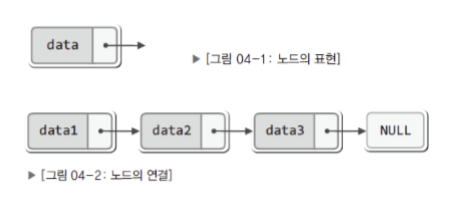
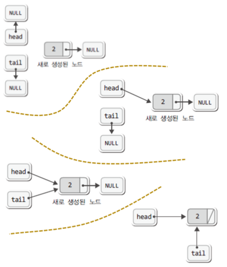
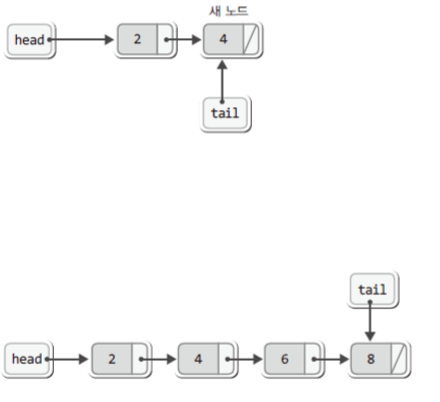
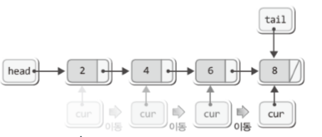
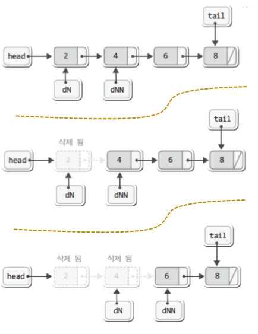
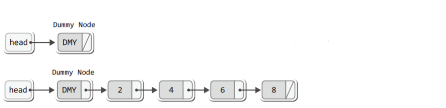
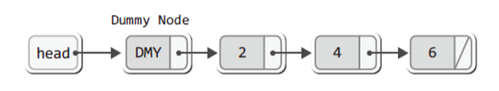
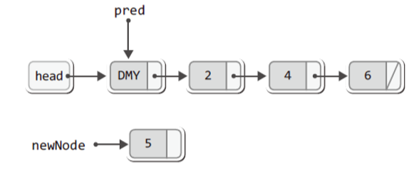
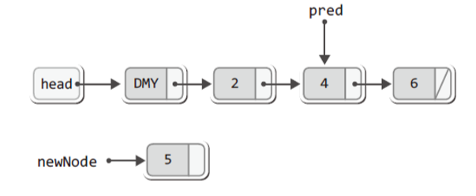
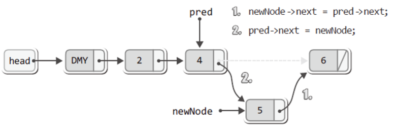

# chapter 04
## 연결 리스트의 개념적인 이해
### Linked! 무엇을 연결하겠다는 뜻인가!
- LinkedRead.c

``` C
#include <stdio.h>
#include <stdlib.h>

typedef struct _node
{
	int data;
	struct _node * next;
} Node;

int main(void)
{
	Node * head = NULL;    // NULL 포인터 초기화
	Node * tail = NULL;
	Node * cur = NULL;

	Node * newNode = NULL;
	int readData;

	/**** 데이터를 입력 받는 과정 ****/
	while(1)
	{
		printf("자연수 입력: ");
		scanf("%d", &readData);
		if(readData < 1)
			break;

		/*** 노드의 추가과정 ***/
		newNode = (Node*)malloc(sizeof(Node));
		newNode->data = readData;
		newNode->next = NULL;

		if(head == NULL)
			head = newNode;
		else
			tail->next = newNode;

		tail = newNode;
	}
	printf("\n");

	/**** 입력 받은 데이터의 출력과정 ****/
	printf("입력 받은 데이터의 전체출력! \n");
	if(head == NULL) 
	{
		printf("저장된 자연수가 존재하지 않습니다. \n");
	}
	else 
	{
		cur = head; 
		printf("%d  ", cur->data);   // 첫 번째 데이터 출력
		
		while(cur->next != NULL)    // 두 번째 이후의 데이터 출력
		{
			cur = cur->next;
			printf("%d  ", cur->data);
		}
	}
	printf("\n\n");

	/**** 메모리의 해제과정 ****/
	if(head == NULL) 
	{
		return 0;    // 해제할 노드가 존재하지 않는다.
	}
	else 
	{
		Node * delNode = head;
		Node * delNextNode = head->next;

		printf("%d을(를) 삭제합니다. \n", head->data);
		free(delNode);    // 첫 번째 노드의 삭제
		
		while(delNextNode != NULL)    // 두 번째 이후의 노드 삭제 위한 반복문
		{
			delNode = delNextNode;
			delNextNode = delNextNode->next;

			printf("%d을(를) 삭제합니다. \n", delNode->data);
			free(delNode);    // 두 번째 이후의 노드 삭제
		}
	}

	return 0;
}
```

- LinkedRead.c에 정의된 구조체
``` C
typedef struct _node 
{     
    int data;     // 데이터를 담을 공간     
    struct _node * next;    // 연결의 도구! 
} Node; // 일종의 바구니, 연결이 가능한 바구니
```

> 노드란 구조체의 변수를 뜻한다.



- head, tail, cur
``` C
int main(void) 
{     
    Node * head = NULL; // 연결 리스트의 시작부분    
    Node * tail = NULL; // 연결 리스트의 끝부분    
    Node * cur = NULL;  // 순차적 접근을 위한것        
    
    Node * newNode = NULL;     
    int readData;     
    . . . .  
}
// LinkedRead.c의 일부
``` 

 - head, tail, cur이 연결 리스트의 핵심!
 - head와 tail은 연결을 추가 및 유지하기 위한것
 - cur은 참조 및 조회를 위한것

### 연결 리스트에서의 데이터 삽입

``` C
while(1) 
{     
    printf("자연수 입력: ");     
    scanf("%d", &readData);     
    if(readData < 1)         
        break;          
    
    // 노드의 추가과정     
    newNode = (Node*)malloc(sizeof(Node));     
    newNode->data = readData;     
    newNode->next = NULL;          
    
    if(head == NULL)         
        head = newNode;     
    else         
        tail->next = newNode;          
    
    tail = newNode;  
}
// LinkedRead.c의 일부
```
- 삽입 1회전


- 삽입 2회전



### 연결 리스트에서의 데이터 조회

``` C
if(head == NULL) 
{      
    printf("저장된 자연수가 존재하지 않습니다. \n"); } 
else 
{      
    cur = head;       
    printf("%d ", cur->data);      
    while(cur->next != NULL)      
    {           
        cur = cur->next;           
        printf("%d ", cur->data);      
    } 
}
```



### 연결 리스트에서의 데이터 삭제

``` C
if(head == NULL) 
{
	return 0;    // 해제할 노드가 존재하지 않는다.
}
else 
{
	Node * delNode = head;
	Node * delNextNode = head->next;

	printf("%d을(를) 삭제합니다. \n", head->data);
	free(delNode);    // 첫 번째 노드의 삭제
		
	while(delNextNode != NULL)    // 두 번째 이후의 노드 삭제 위한 반복문
	{
		delNode = delNextNode;
		delNextNode = delNextNode->next;

		printf("%d을(를) 삭제합니다. \n", delNode->data);
		free(delNode);    // 두 번째 이후의 노드 삭제
	}
}
```



## 단순 연결 리스트의 ADT와 구현
### 정렬 기능이 추가된 연결 리스트의 ADT 정의
- void ListInit(List * plist);
	- 초기화할 리스트의 주소 값을 인자로 전달한다.
	- 리스트 생성 후 제일 먼저 호출되어야 하는 함수이다.
<br><br>
- void LInsert(List * plist, LData data);
	- 리스트에 데이터를 저장한다. 매개변수 data에 전달된 값을 저장한다.
<br><br>
- int LFirst(List * plist, LData data);
	- 첫 번째 데이터가 pdata가 가리키는 메모리에 저장된다.
	- 데이터의 참조를 위한 초기화가 진행된다.
	- 참조 성공 시 TRUE(1), 실패 시 FALSE(0) 반환
<br><br>
- int LNext(List * plist, LData data);
	- 참조된 데이터의 다음 데이터가 pdata가 가리키는 메모리에 저장된다.
	- 순차적인 참조를 위해서 반복 호출이 가능하다.
	- 참조를 새로 시작하려면 먼저 LFirst 함수를 호출해야 한다.
	- 참조 성공 시 TRUE(1), 실패 시 FALSE(0) 반환
<br><br>
- LData LRemove(List * plist);
	- LFirst 또는  LNext 함수의 마지막 반환 데이터를 삭제한다.
	- 삭제된 데이터는 반환된다.
	- 마지막 반환 데이터를 삭제하므로 연이은 반복 호출을 허용하지 않는다.
<br><br>
- int LCount(List * plist);
	- 리스트에 저장되어 있는 데이터의 수를 반환한다.
<br><br>
- void SetSortRule(List * plist, int (*comp)(LData d1, LData d2));
	- 리스트에 정렬의 기준이 되는 함수를 등록한다.
 
>SetSortRule 함수는 정렬의 기준을 설정하기 위해 정의된 함수! 이 함수의 선언 및 정의를 이해하기 위해서는 „함수 포인터‟의 대한 이해가 필요하다.
 
### 새 노드의 추가 위치에 따른 장점과 단점

#### 새 노드를 연결 리스트의 머리에 추가하는 경우
- 장점 : 포인터 변수 tail이 불필요하다.
- 단점 : 저장된 순서를 유지하지 않는다.

#### 새 노드를 연결 리스트의 꼬리에 추가하는 경우
- 장점 : 저장된 순서가 유지된다.
- 단점 : 포인터 변수 tail이 필요하다.

> 두 가지 다 가능한 방법이다. 다만 tail의 관리를 생략하기 위해서 머리에 추가하는 것을 원칙으로 하자!

### SetSortRule 함수 선언에 대한 이해

``` C
void SetSortRule(List * plist, int (*comp)(LData d1, LData d2));
```
> "반환형이 int이고 LData형 인자를 두 개 전달받는 함수의 주소 값을 두 번째 인자로 전달해라!"

#### 인자로 전달이 가능한 함수의 예
``` C 
int WhoIsPrecede(LData d1, LData d2)    // typedef int LData; 
{     
    if(d1 < d2)         
        return 0;       // d1이 정렬 순서상 앞선다.     
    else         
        return 1;       // d2가 정렬 순서상 앞서거나 같다. 
}
```

> 이렇듯 결정된 약속을 근거로 함수가 정의되어야 하며, 연결 리스트 또한 이를 근거로 구현되어야 한다.

### 더미 노드(Dummy Node) 기반의 단순 연결 리스트

#### 더미 노드(Dummy Node) 란?
 - 유효한 데이터를 지니지 않는 그냥 빈 노드를 일컫는 말이다.
 
#### 머리에 새 노드를 추가하되 더미 노드가 있는 연결 리스트


> 노드의 추가 및 삭제 방식이 항상 일정하다.

### 정렬 기능이 추가된 연결 리스트의 구조체와 헤더파일의 정의

#### 노드의 구조체 표현

``` C
typedef struct node
{
    LData data;  // typedef int LData
    struct _node * next;
} Node;
```
> 연결 리스트에 필요한 변수들을 구조체로 묶지 않는ㄴ 것은 옳지 못하다.

#### 연결 리스트의 구조체 표현

``` C
typedef struct _linkedList
{
    Node * head;          // 더미 노드를 가리키는 멤버
    Node * cur;           // 참조 및 삭제를 돕는 멤버
    Node * before;        // 삭제를 돕는 멤보
    int numOfData         // 저장된 데이터의 수를 기록하기 위한 멤버
    int (*comp)(LData d1, LData d2); // 정렬의 기준을 등록하기 위한 멤버
} LinkedList;
```

### 정렬 기능이 추가된 연결 리스트 헤더파일
- DLinkedList.h

``` h
#ifndef __D_LINKED_LIST_H__
#define __D_LINKED_LIST_H__

#define TRUE	1
#define FALSE	0

typedef int LData;

typedef struct _node
{
	LData data;
	struct _node * next;
} Node;

typedef struct _linkedList
{
	Node * head;
	Node * cur;
	Node * before;
	int numOfData;
	int (*comp)(LData d1, LData d2);
} LinkedList;


typedef LinkedList List;

void ListInit(List * plist);
void LInsert(List * plist, LData data);

int LFirst(List * plist, LData * pdata);
int LNext(List * plist, LData * pdata);

LData LRemove(List * plist);
int LCount(List * plist);

void SetSortRule(List * plist, int (*comp)(LData d1, LData d2));

#endif
```

### 더미 노드 기반의 단순 연결 리스트 구현

- DLinkedList.c

``` C
#include <stdio.h>
#include <stdlib.h>
#include "DLinkedList.h"

void ListInit(List * plist)
{
	plist->head = (Node*)malloc(sizeof(Node)); // 더미 노드의 생성
	plist->head->next = NULL;
	plist->comp = NULL;
	plist->numOfData = 0;
}

// 삽입
void LInsert(List * plist, LData data)
{
	if(plist->comp == NULL)    // 정렬기준이 마련되지 않았다면,
		FInsert(plist, data);  // 머리에 노드를 추가!
	else                       // 정렬기준이 마련되었다면,
		SInsert(plist, data);  // 정렬기준에 근거하여 노드를 추가!
}

void FInsert(List * plist, LData data)
{
	Node * newNode = (Node*)malloc(sizeof(Node));  // 새 노드 생성
	newNode->data = data;                          // 새 노드에 데이터 저장

	newNode->next = plist->head->next;             // 새 노드가 다른 노드를 가리키게 함
	plist->head->next = newNode;                   // 더미 노드가 개 노드를 가리키게 함

	(plist->numOfData)++;                          // 저장된 노드의 수를 하나 증가시킴
}

void SInsert(List * plist, LData data)
{
	Node * newNode = (Node*)malloc(sizeof(Node));
	Node * pred = plist->head;
	newNode->data = data;

	while(pred->next != NULL &&
		plist->comp(data, pred->next->data) != 0)
	{
		pred = pred->next;
	}

	newNode->next = pred->next;
	pred->next = newNode;

	(plist->numOfData)++;
}

// 참조
int LFirst(List * plist, LData * pdata)
{
	if(plist->head->next == NULL)   // 더미 노드가 NULL을 가리킨다면,
		return FALSE;               // 반환할 데이터가 없다!

	plist->before = plist->head;    // before는 더미 노드를 가리키게 함
	plist->cur = plist->head->next; // cur은 첫 번째 노드를 가리키게 함

	*pdata = plist->cur->data;      // 첫 번째 노드의 데이터를 전달
	return TRUE;                    // 데이터 반환 성공!
}

int LNext(List * plist, LData * pdata)
{
	if(plist->cur->next == NULL)    // 더미 노드가 NULL을 가리킨다면,
 		return FALSE;               // 반환할 데이터가 없다!

	plist->before = plist->cur;     // cur이 가리키던 것을 before가 가리킴
	plist->cur = plist->cur->next;  // cur은 그 다음 노드를 가리킴

	*pdata = plist->cur->data;      // cur이 가리키는 노드의 데이터 전달
	return TRUE;                    // 데이터 반환 성공!
}

// 삭제
LData LRemove(List * plist)
{
	Node * rpos = plist->cur;       // 소멸 대상의 주소 값을 rpos에 저장
	LData rdata = rpos->data;       // 소멸 대상의 데이터를 rdata에 저장

	plist->before->next = plist->cur->next; // 소멸 대상을 리스트에서 제거
	plist->cur = plist->before;             // cur이 가리키는 위치를 재조정!

	free(rpos);                     // 리스트에서 제거된 노드 소멸 
	(plist->numOfData)--;           // 저장된 데이터의 수 하나 감수
	return rdata;                   // 제거된 노드의 데이터 반환
}

int LCount(List * plist)
{
	return plist->numOfData;
}

void SetSortRule(List * plist, int (*comp)(LData d1, LData d2))
{
	plist->comp = comp;
}
```

- DLinkedListMain.c

``` C
#include <stdio.h>
#include "DLinkedList.h"

int WhoIsPrecede(int d1, int d2)
{
	if(d1 < d2)
		return 0;    // d1이 정렬 순서상 앞선다.
	else
		return 1;    // d2가 정렬 순서상 앞서거나 같다.
}

int main(void)
{
	// List의 생성 및 초기화  ////////////
	List list;
	int data;
	ListInit(&list);

	SetSortRule(&list, WhoIsPrecede);

	// 5개의 데이터 저장  ///////////////
	LInsert(&list, 11);  LInsert(&list, 11);
	LInsert(&list, 22);  LInsert(&list, 22);
	LInsert(&list, 33);

	// 저장된 데이터의 전체 출력 ////////////
	printf("현재 데이터의 수: %d \n", LCount(&list));

	if(LFirst(&list, &data))
	{
		printf("%d ", data);
		
		while(LNext(&list, &data)) 
			printf("%d ", data);
	}
	printf("\n\n");

	// 숫자 22을 검색하여 모두 삭제 ////////////
	if(LFirst(&list, &data))
	{
		if(data == 22)
			LRemove(&list);
		
		while(LNext(&list, &data))
		{
			if(data == 22)
				LRemove(&list);
		}
	}

	// 삭제 후 저장된 데이터 전체 출력 ////////////
	printf("현재 데이터의 수: %d \n", LCount(&list));

	if(LFirst(&list, &data))
	{
		printf("%d ", data);
		
		while(LNext(&list, &data))
			printf("%d ", data);
	}
	printf("\n\n");
	return 0;
}
```

- 실행결과<br>
> 현재 데이터의 수 : 5<br>
> 33 22 22 11 11<br>
><br>
> 현재 데이터의 수 : 3<br>
> 33 11 11<br>

## 연결 리스트의 정렬 삽입의 구현
### 정렬기준 설정과 관련된 부분
#### 단순 연결 리스트의 정렬 관련 요소 세 가지
- 정렬기준이 되는 함수를 등록하는 SetSortRule 함수
- SetSortRule 함수를 통해 전달된 함수정보 저장을 위한 LinkedList의 멤버 comp
- comp에 등록된 정렬기준을 근거로 데이터를 저장하는 SInsert 함수
<br>

#### 하나의 문장으로 구성한 결과

> " SetSortRule 함수가 호출되면서 정렬의 기준이 리스트의 멤버 comp에 등록되면, SInsert함수 내에서는 comp에 등록된 정렬의 기준을 근거로 데이터를 정렬하여 저장한다."


### SInsert 함수

``` C
void SInsert(List * plist, LData data)
{
	Node * newNode = (Node*)malloc(sizeof(Node));
	Node * pred = plist->head;
	newNode->data = data;

	while(pred->next != NULL &&
		plist->comp(data, pred->next->data) != 0)
	{
		pred = pred->next;
	}

	newNode->next = pred->next;
	pred->next = newNode;

	(plist->numOfData)++;
}
```
- 오름차순으로 저장된 연결리스트

<br><br>

- 위 상황에서 다음 문장이 실행되었다고 가정! SInsert(&slist, 5);






### 정렬의 핵심인 while 반복문
#### 반복의 조건
- pred->next != NULL
  - pred가 리스트의 마지막 노드를 가리키는지 묻기 위한 연산
<br><br>

- plist->comp(data, pred->next->data) != 0
  - 새 데이터와 pred의 다음 노드에 저장된 데이터의 우선순위 비교를 위한 함수호출 
   
### comp의 반환 값과 그 의미

``` C
while(pred->next != NULL && plist->comp(data, pred->next->data) != 0)
	{
		pred = pred->next; // 다음 노드로 이동
	}
```

#### 이 내용을 근거로 SInsert 함수를 정의하였다.
- comp가 0을 반환
	- 첫 번째 인자인 data가 정렬 순서상 앞서서 head에 더 가까워야 하는 경우
<br><br>
- comp가 1을 반환
	- 두 번째 인자인 pred->next->data가 정렬 순서상 앞서서 head에 더 가까워야 하는 경우

### 정렬의 기준을 설정하기 위한 함수의 정의
#### 함수의 정의 기준
- 두 개의 인자를 전달받도록 함수를 정의한다.
- 첫 번째 인자의 정렬 우선순위가 높으면 0을, 그렇지 않으면 1을 반환한다.
<br><br>

#### 오름차순 정렬을 위한 함수의 정의

``` C
int WhoIsPrecede(int d1, int d2)
{
	if(d1 < d2)
		return 0;    // d1이 정렬 순서상 앞선다.
	else
		return 1;    // d2가 정렬 순서상 앞서거나 같다.
}
```
