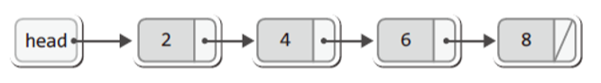
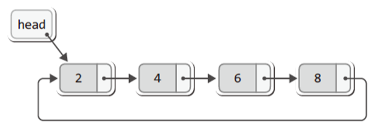
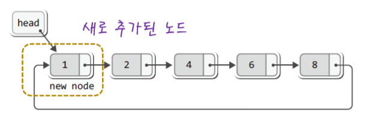
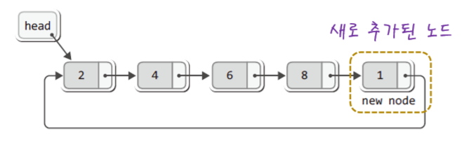
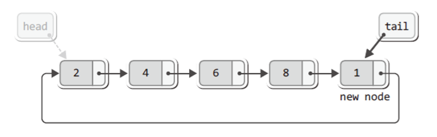
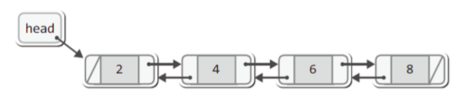
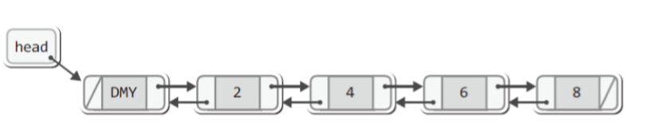
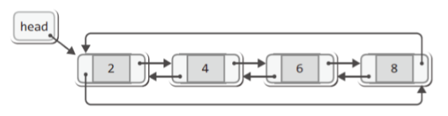
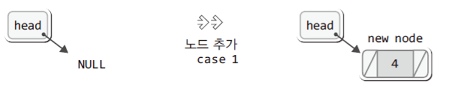
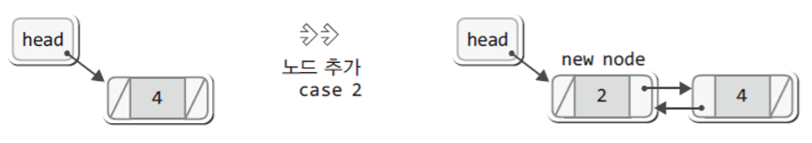

# Chapter 05
## 원형 연결 리스트
### 원형 연결 리스트의 이해
#### 단순 연결 리스트의 마지막 노드는 NULL을 가리킨다.


#### 원형 연결 리스트의 마지막 노드는 첫 번째 노드를 가리킨다.


### 원형 연결 리스트의 노드 추가
#### 원형 연결 리스트의 머리에 노드 추가


#### 원형 연결 리스트의 꼬리에 노드 추가


> 이렇듯 모든 노드가 원의 형태를 이루면서 연결되어 있기 때문에 원형 연결 리스트에서는 사실상 머리와 꼬리의 구분이 없다.

#### 같고 또 다른점!
- 같은점 : 두 경우의 노드 연결 순서가 같다.
- 다른점 : head가 가리키는 노드가 다르다.

### 원형 연결 리스트의 대표적인 장점
#### 원형 연결 리스트에서 놓칠 수 없는 장점
> "단순 연결 리스트처럼 머리와 꼬리를 가리키는 포인터 변수를 각각 두지 않아도, 하나의 포인터 변수만 있어도 머리 또는 꼬리에 노드를 간단히 추가할 수 있다."

### 변형된 원형 연결 리스트


- 꼬리를 가리키는 포인터 변수 
  - tail
- 머리를 가리키는 포인터 변수
 - tail -> next
 
> 이렇듯 리스트의 꼬리와 머리의 주소 값을 쉽게 확인할 수 있기 때문에 연결 리스트를 가리키는 포인터 변수는 하나만 있으면 된다.

### 변형된 원형 연결 리스트의 구현범위


> 원형 연결 리스트는 그 구조상 끝이 존재하지 않는다. 따라서 LNext 함수는 계속해서 호출이 가능하고, 이로 인해서 리스트를 순환하면서 저장된 값을 반환하도록 구현한다.

### 원형 연결 리스트의 헤더파일과 리스트파일
#### CLinkedList.h

``` h
#ifndef __C_LINKED_LIST_H__
#define __C_LINKED_LIST_H__

#define TRUE	1
#define FALSE	0

typedef int Data;

typedef struct _node
{
	Data data;
	struct _node * next;
} Node;

typedef struct _CLL
{
	Node * tail;
	Node * cur;
	Node * before;
	int numOfData;
} CList;


typedef CList List;

void ListInit(List * plist);
void LInsert(List * plist, Data data);
void LInsertFront(List * plist, Data data);

int LFirst(List * plist, Data * pdata);
int LNext(List * plist, Data * pdata);
Data LRemove(List * plist);
int LCount(List * plist);

#endif
```

#### CLinkedList.c

``` C
#include <stdio.h>
#include <stdlib.h>
#include "CLinkedList.h"

void ListInit(List * plist)
{
	plist->tail = NULL;
	plist->cur = NULL;
	plist->before = NULL;
	plist->numOfData = 0;
}

void LInsertFront(List * plist, Data data)
{
	Node * newNode = (Node*)malloc(sizeof(Node)); // 새 노드 생성
	newNode->data = data;                         // 새 노드에 데이터 저장

	if(plist->tail == NULL)                       
	{                                             // 첫 번째 노드라면
		plist->tail = newNode;                    // tail이 새 노드를 가리키게 한다.
		newNode->next = newNode;                  // 새 노드 자신을 가리케게 한다.
	}
	else                          
    {                                             // 두 번째 이후 노드라면
		newNode->next = plist->tail->next;        // 새 노드와 4가 저장된 노드 연결
		plist->tail->next = newNode;              // 2가 저장된 노드와 새 노드 연결
	}

	(plist->numOfData)++;
}

void LInsert(List * plist, Data data)
{
	Node * newNode = (Node*)malloc(sizeof(Node));  // 새 노드 생성
	newNode->data = data;                         // 새 노드에 데이터 저장

	if(plist->tail == NULL) 
	{                                             // 첫 번째 노드라면
		plist->tail = newNode;                    // tail이 새 노드를 가리키게 한다.
		newNode->next = newNode;                  // 새 노드 자신을 가리케게 한다.
	}
	else 
	{                                             // 두 번째 이후 노드라면
		newNode->next = plist->tail->next;        // 새 노드와 4가 저장된 노드 연결
		plist->tail->next = newNode;              // 2가 저장된 노드와 새 노드 연결
		plist->tail = newNode;                    // LInsertFront 함수와의 유일한 차이점
	}

	(plist->numOfData)++;
}

int LFirst(List * plist, Data * pdata)
{
	if(plist->tail == NULL)         // 저장된 노드가 없다면
		return FALSE;

	plist->before = plist->tail;    // before가 꼬리를 가리케게 한다.
	plist->cur = plist->tail->next; // cur이 머리를 가리키게 한다.

	*pdata = plist->cur->data;      // cur이 가리키는 노드의 데이터 반환
	return TRUE;
}

int LNext(List * plist, Data * pdata)
{
	if(plist->tail == NULL)        // 저장된 노드가 없다면
		return FALSE;

	plist->before = plist->cur;    // before가 다음 노드를 가리케게 한다.
	plist->cur = plist->cur->next; // cur이 다음 노드를 가리키게 한다.

	*pdata = plist->cur->data;     // cur이 가리키는 노드의 데이터 반환
	return TRUE;
}

Data LRemove(List * plist)
{
	Node * rpos = plist->cur;
	Data rdata = rpos->data;

	if(rpos == plist->tail)    // 삭제 대상을 tail이 가리킨다면
	{
		if(plist->tail == plist->tail->next)    // 그리고 마지막 남은 노드라면
			plist->tail = NULL;
		else
			plist->tail = plist->before;
	}

	plist->before->next = plist->cur->next;
	plist->cur = plist->before;

	free(rpos);
	(plist->numOfData)--;
	return rdata;
}

int LCount(List * plist)
{
	return plist->numOfData;
}
```

#### CLinkedListMain.c

``` C
#include <stdio.h>
#include "CLinkedList.h"

int main(void)
{
	// 원형 연결 리스트의 생성 및 초기화 ///////
	List list;
	int data, i, nodeNum;
	ListInit(&list);

	// 리스트에 5개의 데이터를 저장 /////// 
	LInsert(&list, 3);
	LInsert(&list, 4);
	LInsert(&list, 5);
	LInsertFront(&list, 2);
	LInsertFront(&list, 1);
	
	// 리스트에 저장된 데이터를 연속 3회 출력 ///////
	if(LFirst(&list, &data))
	{
		printf("%d ", data);
		
		for(i=0; i<LCount(&list)*3-1; i++)
		{
			if(LNext(&list, &data))
				printf("%d ", data);
		}
	}
	printf("\n");

	// 2의 배수를 찾아서 모두 삭제 ///////
	nodeNum = LCount(&list);

	if(nodeNum != 0)
	{
		LFirst(&list, &data);
		if(data%2 == 0)
			LRemove(&list);
		
		for(i=0; i < nodeNum-1; i++)
		{
			LNext(&list, &data);
			if(data%2 == 0)
				LRemove(&list);
		}
	}

	// 전체 데이터 1회 출력 ///////
	if(LFirst(&list, &data))
	{
		printf("%d ", data);
		
		for(i=0; i<LCount(&list)-1; i++)
		{
			if(LNext(&list, &data))
				printf("%d ", data);
		}
	}
	return 0;
}
```

## 양방향 연결 리스트
### 양방향 연결 리스트의 이해
#### 양방양 연결 리스트를 위한 노드의 표현
``` C
typedef struct _node
{
    Data data;
    struct _node * next;
    struct _node * prev;
} Node;
```





### 양방향으로 노드를 연결하는 이유
``` C
int LNext(List * plist, Data * pdata)
{
	if(plist->cur->next == NULL)
		return FALSE;

	plist->cur = plist->cur->next;
	*pdata = plist->cur->data;

	return TRUE;
}
```

- 오른쪽 노드로의 이동이 용이하다. 양방향으로 이동이 가능하다.
- 위의 코드에서 보이듯이 양방향으로 연결한다.하여 더 복잡한 것은 아니다.

### 양방향 연결 리스트의 헤어파일
#### DBLinkedList.h
``` h
#ifndef __DB_LINKED_LIST_H__
#define __DB_LINKED_LIST_H__

#define TRUE	1
#define FALSE	0

typedef int Data;

typedef struct _node
{
	Data data;
	struct _node * next;
	struct _node * prev;
} Node;

typedef struct _dbLinkedList
{
	Node * head;
	Node * cur;
	int numOfData;
} DBLinkedList;

typedef DBLinkedList List;

void ListInit(List * plist);
void LInsert(List * plist, Data data);

int LFirst(List * plist, Data * pdata);
int LNext(List * plist, Data * pdata);
int LPrevious(List * plist, Data * pdata);

int LCount(List * plist);

#endif
```

### 양방향 연결 리스트의 구현
#### 노드 삽입의 구분




> 더미 노드를 기반으로 하지 않기 때문에 노드의 삽입 방법은 두가지로 구분이 된다.

``` C
void LInsert(List * plist, Data data)
{
	Node * newNode = (Node*)malloc(sizeof(Node));
	newNode->data = data;

	newNode->next = plist->head;
	if(plist->head != NULL)              // 추가된 if문
		plist->head->prev = newNode;

	newNode->prev = NULL;
	plist->head = newNode;

	(plist->numOfData)++;
}
```

> 첫 번째 노드의 추가 과정에 덧붙여서, if문이 포함하는 문장이 두 번째 이후의 노드 추가 과정에서는 요구가 된다

#### 데이터 조회
``` C
int LFirst(List * plist, Data * pdata)
{
	if(plist->head == NULL)
		return FALSE;

	plist->cur = plist->head;
	*pdata = plist->cur->data;

	return TRUE;
}

int LNext(List * plist, Data * pdata)
{
	if(plist->cur->next == NULL)
		return FALSE;

	plist->cur = plist->cur->next;
	*pdata = plist->cur->data;

	return TRUE;
}

int LPrevious(List * plist, Data * pdata)
{
	if(plist->cur->prev == NULL)
		return FALSE;

	plist->cur = plist->cur->prev;
	*pdata = plist->cur->data;

	return TRUE;
}

```

> LFirst 함수와 LNext  함수는 사실상 단방향 연결 리스 트의 경우와 차이가 없다. 그리고 LPrevious 함수는 LNext 함수와 이동 방향에서맊 차이가 난다. 

### 양방향 연결 리스트 코드
#### CLinkedList.c
``` C
#include <stdio.h>
#include <stdlib.h>
#include "DBLinkedList.h"

void ListInit(List * plist)
{
	plist->head = NULL;
	plist->numOfData = 0;
}

void LInsert(List * plist, Data data)
{
	Node * newNode = (Node*)malloc(sizeof(Node));
	newNode->data = data;

	newNode->next = plist->head;
	if(plist->head != NULL)
		plist->head->prev = newNode;

	newNode->prev = NULL;
	plist->head = newNode;

	(plist->numOfData)++;
}

int LFirst(List * plist, Data * pdata)
{
	if(plist->head == NULL)
		return FALSE;

	plist->cur = plist->head;
	*pdata = plist->cur->data;

	return TRUE;
}

int LNext(List * plist, Data * pdata)
{
	if(plist->cur->next == NULL)
		return FALSE;

	plist->cur = plist->cur->next;
	*pdata = plist->cur->data;

	return TRUE;
}

int LPrevious(List * plist, Data * pdata)
{
	if(plist->cur->prev == NULL)
		return FALSE;

	plist->cur = plist->cur->prev;
	*pdata = plist->cur->data;

	return TRUE;
}

int LCount(List * plist)
{
	return plist->numOfData;
}
```

#### CLinkedListMain.c

``` C
#include <stdio.h>
#include "CLinkedList.h"

int main(void)
{
	// 원형 연결 리스트의 생성 및 초기화 ///////
	List list;
	int data, i, nodeNum;
	ListInit(&list);

	// 리스트에 5개의 데이터를 저장 /////// 
	LInsert(&list, 3);
	LInsert(&list, 4);
	LInsert(&list, 5);
	LInsertFront(&list, 2);
	LInsertFront(&list, 1);
	
	// 리스트에 저장된 데이터를 연속 3회 출력 ///////
	if(LFirst(&list, &data))
	{
		printf("%d ", data);
		
		for(i=0; i<LCount(&list)*3-1; i++)
		{
			if(LNext(&list, &data))
				printf("%d ", data);
		}
	}
	printf("\n");

	// 2의 배수를 찾아서 모두 삭제 ///////
	nodeNum = LCount(&list);

	if(nodeNum != 0)
	{
		LFirst(&list, &data);
		if(data%2 == 0)
			LRemove(&list);
		
		for(i=0; i < nodeNum-1; i++)
		{
			LNext(&list, &data);
			if(data%2 == 0)
				LRemove(&list);
		}
	}

	// 전체 데이터 1회 출력 ///////
	if(LFirst(&list, &data))
	{
		printf("%d ", data);
		
		for(i=0; i<LCount(&list)-1; i++)
		{
			if(LNext(&list, &data))
				printf("%d ", data);
		}
	}
	return 0;
}
```
